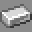
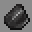
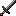

# Ronoaldo Minecraft Add-on 

Add-on for Minecraft made with my kids! This is my first Minecraft Bedrock
Add-on project so the learning curve was quite hard. Thankfuly, with the help
of other add-on developers and the bedrock.dev community, I was able to get
this working and had a great time with Pedro and Igor!

## What is in the pack?

This is a Lucky Block like mod for Bedrock. Players get a new type of block,
the `Lucky Block`, that drops a random item or mob when destroyed by a
player.

The drop can be a good luck drop, with one of hundreds of possible items,
including simple ones, like doors, or advanced ones, like a diamond sword.
Equipment drops can also be enchanted when dropped, so you can get even more
lucky!

The drop can also be a bad luck drop, where you are faced with a mob like a
Zombie, Skeleton or even a Creeper.

## New items

###  Lucky Block 

The most notable item added is the Lucky Block, and you can craft one with
the recipe bellow:

|                                          |                                          |                                          |
|:----------------------------------------:|:----------------------------------------:|:----------------------------------------:|
|  |  |  |
|  |            |  |
|  |  |  |

###  Rono Sword

This mod also adds a new item, the legendary `Rono Sword`. This one is only
available as a drop from the `Lucky Block`, since it has no recipe for
building it as of now.

## Functions

You can also use a function to help you building some lucky block fun.

For instance, to spawn a tower of `Lucky Blocks` you can call the function
`/function rono/luckytower`.

## Contributions

I would like to thank for all the membes of the Discord server Bedrock
Addons, who made this project possible.
